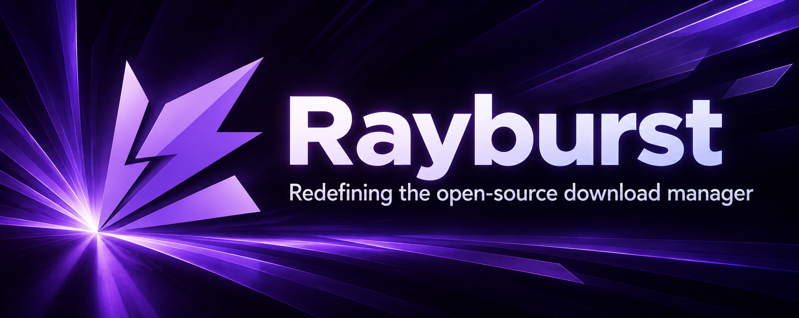
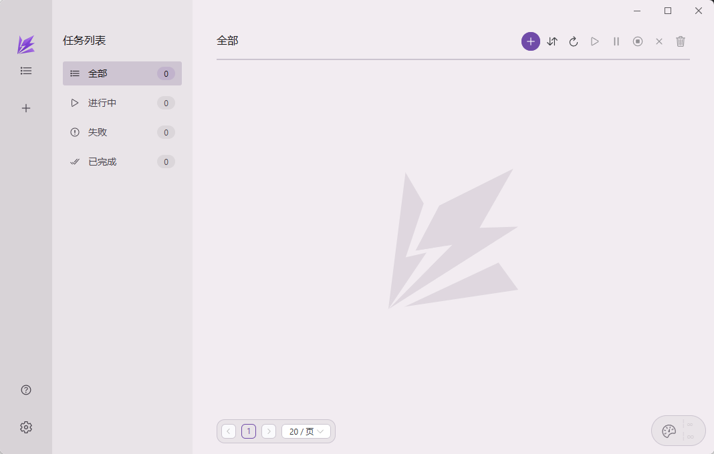
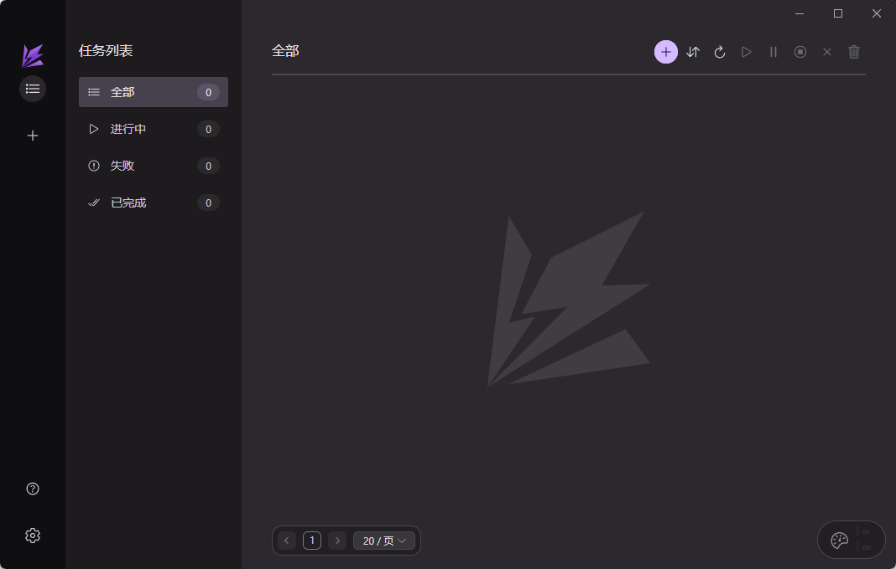

<div align="center">
  

[](https://github.com/AnInsomniacy/rayburst/releases)


<br>


[](https://rayburst.pages.dev/)
[](https://github.com/AnInsomniacy/rayburst-connect)

</div>

> [!IMPORTANT]
> **Motrix Next is now Rayburst.** We recommend uninstalling the previous desktop app before installing Rayburst. Settings, tasks and history are not imported; keep your downloaded files. In-app updates may leave both apps installed or retain old shortcuts. Visit the [website](https://rayburst.pages.dev). Published stable builds may still use the previous name while releases catch up.

---

<div align="center">
  <table><tr>
    <td></td>
    <td></td>
  </tr><tr>
    <td align="center"><sub>Light Mode</sub></td>
    <td align="center"><sub>Dark Mode</sub></td>
  </tr></table>
</div>

> [!NOTE]
> Rayburst uses [Aria2 Next](https://github.com/AnInsomniacy/aria2-next) as its download engine, a maintained aria2 fork that preserves the original interfaces while fixing long-standing issues, moving to CMake, adding native ED2K and HLS/DASH support, and updating modern dependencies.

## Design & Motion

Every transition and micro-interaction has been carefully tuned to follow [Material Design 3](https://m3.material.io/styles/motion/overview) motion guidelines:

- **Asymmetric timing** — enter animations are slightly longer than exits, giving new content time to land while dismissed content leaves quickly
- **Emphasized easing curves** — decelerate on enter (`cubic-bezier(0.2, 0, 0, 1)`), accelerate on exit (`cubic-bezier(0.3, 0, 0.8, 0.15)`), replacing generic `ease` curves throughout the codebase
- **Spring-based modals** — dialogs use physically-modeled spring animations for a natural, responsive feel
- **Consistent motion tokens** — all durations and curves are defined as CSS custom properties, ensuring a unified rhythm across 12+ components

## Features

- **Multi-protocol downloads** — HTTP, HTTPS, SFTP, ED2K, BitTorrent, Magnet, and `.torrent` tasks
- **HLS and DASH** — Native track selection, subtitles, live recording, resumable media downloads and MP4/MKV output. See [media downloads](docs/MEDIA.md).
- **BitTorrent** — Selective file download, DHT, peer exchange, encryption controls, metadata caching, GeoIP peer flags, and tracker probing
- **Browser extension integration** — Embedded Extension API with independent authentication, download confirmation, smart auto-submit, filename hints, referer/cookie forwarding, and real-time controls ([Rayburst Connect](https://github.com/AnInsomniacy/rayburst-connect))
- **Safe filename handling** — Content-Disposition, RFC 2047, non-UTF-8, percent-encoded, and extensionless URL resolution with path traversal sanitization
- **Download organization** — Favorite and recent folders, optional file-type categorization, stale-record cleanup, and completed history backed by SQLite
- **Concurrent downloads** — Independent limits for active tasks, stream connections, and BitTorrent peers
- **Speed control** — Global and per-task upload/download limits with day-of-week and time-of-day scheduling
- **System integration** — Tray operation, optional tray speed display, macOS Dock badge/progress, protocol handlers for `magnet://`, `ed2k://`, `thunder://`, and `rayburst://`
- **Lightweight mode** — Destroys the WebView on minimize-to-tray while Rust keeps the engine, task monitor, notifications, history, and extension routing alive
- **Notifications and power options** — Native task start/complete/failure notifications, keep-awake during downloads, and optional shutdown after completion
- **Network controls** — Scoped proxy support for downloads, app updates, and tracker updates, plus system proxy detection
- **Auto-update channels** — Stable, Beta, and Latest Across Channels policies with separate download and install phases
- **Diagnostics** — Structured logs, exportable diagnostic ZIPs, database integrity checks and Linux GPU rendering fallback
- **Personalization** — Light/dark/system theme, 10 color schemes, 27 languages, and first-launch system language detection
- **Native desktop app** — Tauri 2 with a Rust backend

## Installation

Download the latest release from [GitHub Releases](https://github.com/AnInsomniacy/rayburst/releases).

### macOS

Download the `.dmg` installer from [Releases](https://github.com/AnInsomniacy/rayburst/releases):

| Architecture  | File                         |
| ------------- | ---------------------------- |
| Apple Silicon | `Rayburst_x.x.x_aarch64.dmg` |
| Intel         | `Rayburst_x.x.x_x64.dmg`     |

The `.app.tar.gz` macOS artifacts are published for the Tauri updater.

> [!TIP]
> If macOS says the app is **"damaged and can't be opened"**, see the [FAQ below](#faq).

### Windows

Download the installer from [Releases](https://github.com/AnInsomniacy/rayburst/releases):

| Architecture   | File                             |
| -------------- | -------------------------------- |
| x64 (most PCs) | `Rayburst_x.x.x_x64-setup.exe`   |
| ARM64          | `Rayburst_x.x.x_arm64-setup.exe` |

Run the installer — it takes about 10 seconds, no reboot required.

### Linux

Download directly from [Releases](https://github.com/AnInsomniacy/rayburst/releases):

**Debian / Ubuntu:**

```bash
sudo dpkg -i Rayburst_x.x.x_amd64.deb
```

**Fedora / RHEL:**

```bash
sudo rpm -i Rayburst-x.x.x-1.x86_64.rpm
```

**Other distributions** — use the `.AppImage`:

```bash
chmod +x Rayburst_x.x.x_amd64.AppImage
./Rayburst_x.x.x_amd64.AppImage
```

All formats are available for both x64 and ARM64.

## FAQ

<details>
<summary><strong>macOS says the app is "damaged and can't be opened"</strong></summary>

<br>

This app is not code-signed. Open Terminal and run:

```bash
xattr -dr com.apple.quarantine /Applications/Rayburst.app
```

This removes only Gatekeeper's quarantine attribute. Run it again after each upgrade.

</details>

<details>
<summary><strong>Why is there no portable version?</strong></summary>

<br>

Rayburst relies on [Aria2 Next](https://github.com/AnInsomniacy/aria2-next) as its download engine and launches it through a bundled `aria2-next` sidecar process at runtime. The sidecar binaries are built and released from the aria2-next repository for all 6 supported desktop targets. This architecture means:

- The **Aria2 Next sidecar binary must exist alongside the main executable** — it cannot be embedded into a single `.exe`.
- **Deep links** (`magnet://`, `ed2k://`, `thunder://`) and **file associations** (`.torrent`) require Windows registry entries that only an installer can configure.
- The **auto-updater** needs a known installation path to replace files in place.

These are fundamental constraints of the Tauri sidecar model and the Windows operating system, not limitations we can work around. Notable Tauri projects like [Clash Verge Rev](https://github.com/clash-verge-rev/clash-verge-rev) (80k+ stars) previously shipped portable builds but [discontinued them](https://clash-verge.com/) due to the same set of issues.

We provide **NSIS installers** for Windows — with the bundled download engine.

</details>

## Code Signing

macOS builds use ad-hoc signing and are not notarized. Windows Authenticode signing is optional through the [SignPath workflow](.github/workflows/sign-windows-release.yml). Unsigned installers may trigger browser or system warnings.

The app is fully open-source and every release binary is built automatically by [GitHub Actions CI](https://github.com/AnInsomniacy/rayburst/actions). For added peace of mind, you can always [build from source](#development).

Release `.sig` files are Tauri updater signatures, not GPG signatures. They can be verified with minisign using the two-line public key format required by minisign. Decode `plugins.updater.pubkey` from [tauri.conf.json](src-tauri/tauri.conf.json) from base64 and save it as `rayburst.pub`, then replace `Rayburst_x.x.x_<file>` with the release file you downloaded:

```bash
python3 -c 'import base64,sys; sys.stdout.write(base64.b64decode(sys.stdin.read()).decode())' \
  < Rayburst_x.x.x_<file>.sig \
  > Rayburst_x.x.x_<file>.minisig

minisign -V \
  -m Rayburst_x.x.x_<file> \
  -x Rayburst_x.x.x_<file>.minisig \
  -p rayburst.pub
```

Expected result:

```text
Signature and comment signature verified
```

If the artifact was changed:

```text
Signature verification failed
```

> [!NOTE]
> See our [Code Signing Policy](docs/CODE_SIGNING.md) and [Privacy Policy](docs/PRIVACY.md).

## Development

### Prerequisites

- [Rust](https://rustup.rs/) (latest stable)
- [Node.js](https://nodejs.org/) >= 22
- [pnpm](https://pnpm.io/) 11.x, managed by the `packageManager` field in `package.json`

### Setup

```bash
# Clone the repository
git clone https://github.com/AnInsomniacy/rayburst.git
cd rayburst

# Install frontend dependencies
pnpm install

# Start development server (launches Tauri + Vite)
pnpm tauri dev

# Build for production
pnpm tauri build
```

### Project Structure

```
rayburst/
├── src/                        # Frontend (Vue 3 + TypeScript)
│   ├── api/                    # aria2-compatible JSON-RPC client
│   ├── components/             # Vue components
│   │   ├── about/              #   About panel
│   │   ├── common/             #   Shared UI primitives
│   │   ├── layout/             #   Sidebar, speedometer, navigation
│   │   ├── preference/         #   Settings pages, update dialog
│   │   └── task/               #   Task list, detail, add task
│   ├── composables/            # Reusable composition functions
│   ├── router/                 # Vue Router configuration
│   ├── shared/                 # Shared utilities & config
│   │   ├── locales/            #   27 language packs
│   │   ├── utils/              #   Pure utility functions (with tests)
│   │   ├── types.ts            #   TypeScript interfaces
│   │   ├── constants.ts        #   App constants & defaults
│   │   └── configKeys.ts       #   Persisted config key registry
│   ├── stores/                 # Pinia state management (with tests)
│   ├── styles/                 # Global CSS custom properties
│   └── views/                  # Page-level route views
├── src-tauri/                  # Backend (Rust + Tauri 2)
│   ├── src/
│   │   ├── aria2/              #   Native Rust aria2 JSON-RPC client
│   │   ├── commands/           #   Tauri invoke handlers (config, engine, fs, etc.)
│   │   ├── database/           #   SQLite owner: history, credentials, receipts
│   │   ├── engine/             #   Aria2 Next sidecar lifecycle, runtime config, state, cleanup
│   │   ├── services/           #   Runtime services (stat, speed, monitor, HTTP API, deep links)
│   │   ├── error.rs            #   AppError enum
│   │   ├── gpu_guard.rs        #   Linux GPU compatibility guard
│   │   ├── menu.rs             #   Native menu builder
│   │   ├── tray.rs             #   System tray setup
│   │   ├── upnp.rs             #   UPnP/IGD port mapping
│   │   └── lib.rs              #   Tauri builder & plugin registration
│   ├── native-messaging/       #   Browser Native Messaging launcher
│   └── binaries/               #   Aria2 Next sidecar binaries (6 platforms)
├── scripts/                    # bump-version.sh, release.sh
├── .github/workflows/          # CI (ci.yml) + Release (release.yml)
└── website/                    # Static website (HTML, CSS and JavaScript)
```

## Contributing

PRs and issues are welcome! Please read the [Contributing Guide](docs/CONTRIBUTING.md) and [Code of Conduct](docs/CODE_OF_CONDUCT.md) before getting started.

## Sponsor

Built in the hours I should've been writing my thesis — I'm a PhD student surviving on instant noodles 🍜

macOS builds are ad-hoc signed and not notarized. Windows signing is handled separately through SignPath.

[Buy me a coffee ☕](https://github.com/AnInsomniacy/AnInsomniacy/blob/main/SPONSOR.md) — maybe one day I can afford those certificates, so antivirus software stops treating my app like a criminal 🥲

## License

[MIT](https://opensource.org/licenses/MIT) — Copyright (c) 2025-present AnInsomniacy
